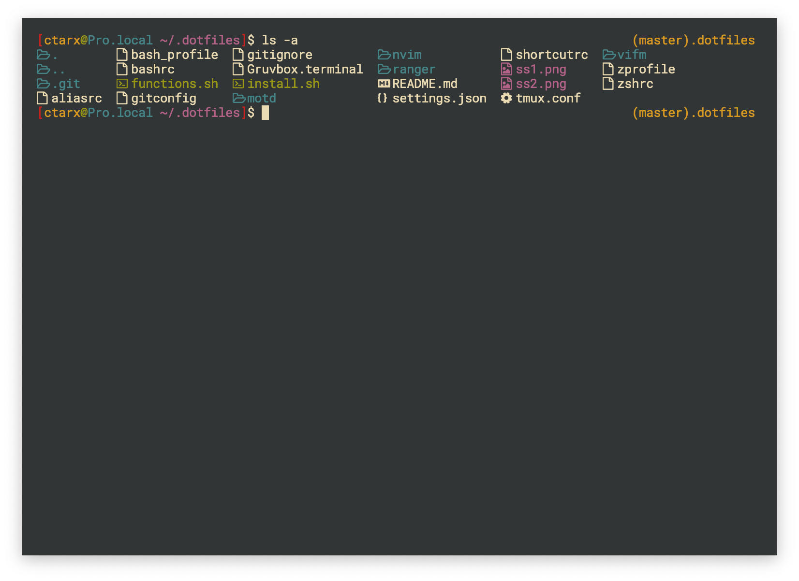

# macOS dotfiles - discontinued
> base configuration files

## Screenshots
 

## Install
```shell
$ cd $HOME
git clone https://github.com/ctarx/dotfiles.git ~/.dotfiles
$ cd ~/.dotfiles
$ ./install.sh
```

### Homebrew apps
- git
- zsh
- zsh-completions
- fasd
- lsd
- ranger
- pcre2
- neovim (I use a [vim-plug](https://github.com/junegunn/vim-plug) for plugins instead of git submodules)
- node
- gotop
- youtube-dl

### Homebrew cask
- brave-browser
- visual-studio-code
- iina
- cakebrew
- iterm2
- mudlet
- bitwarden
- telegram
- discord
- amethyst
- syncthing
- dropbox
- steam
- malwarebytes
- teamviewer
- electrum
- tor-browser
- balenaetcher
- battle-net
- virtualbox

### Configs
- shells (zshrc, bashrc, etc.)
- neovim/vim
- ranger / vifm
- tmux
- vscode settings.js
- motd for arch and raspbian

### Additional
- .hushlogin

### To do
- raspbian dotfiles

#### Inspiration
Install script and prompt inspired by github users:
[Willian Justen](https://github.com/willianjusten/dotfiles) [tiaanduplessis](https://github.com/tiaanduplessis/prompt) [elithrar](https://github.com/elithrar/dotfiles)

#### Contact
Created by [@ctarx](https://linuxrocks.online/@ctarx) - feel free to contact me!
