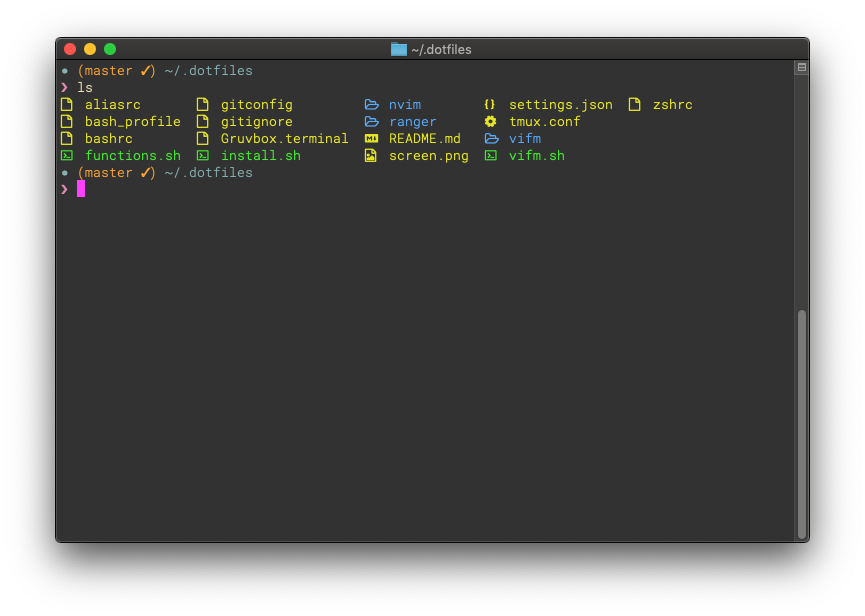
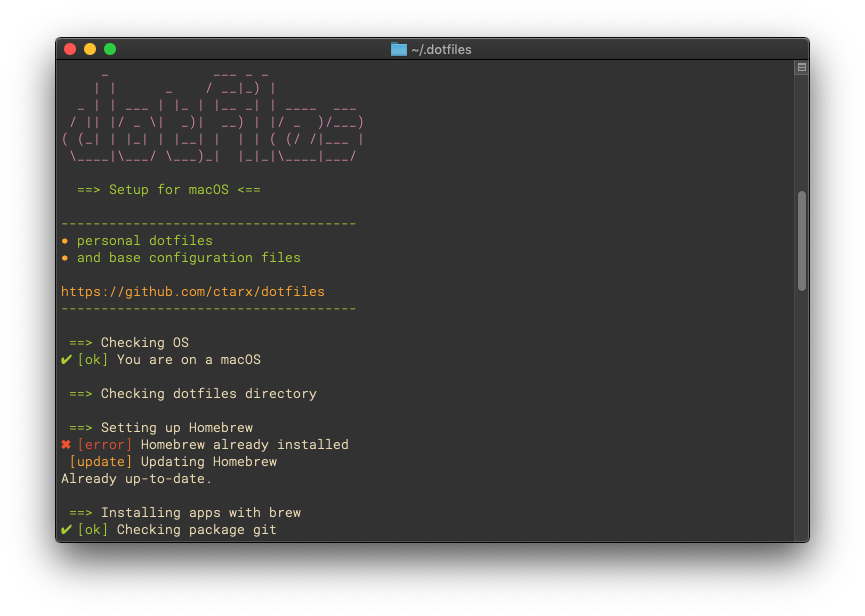

# macOS dotfiles
> base configuration files

## Screenshots
 

## Install
```shell
$ cd $HOME
git clone https://github.com/ctarx/dotfiles.git ~/.dotfiles
$ cd ~/.dotfiles
$ ./install.sh
```

### Homebrew apps
- git
- zsh / bash 5
- zsh-completions
- bash-completion@2
- fasd
- lsd
- ranger / vifm
- pcre2
- neovim (I use a [vim-plug](https://github.com/junegunn/vim-plug) for plugins instead of git submodules)
- node

### Homebrew cask
- google-chrome
- firefox
- visual-studio-code
- iina
- cakebrew

### Configs
- shells (zshrc, bashrc, etc.)
- neovim/vim
- ranger / vifm
- tmux
- vscode settings.js
- motd for arch and raspbian

### Additional
- slimzsh
- .hushlogin

### To do
- raspbian dotfiles
- Set zsh (or bash5) as login shell // (<b>chsh -s $(which zsh)</b>)

#### Inspiration
Install script and prompt inspired by github users:
[Willian Justen](https://github.com/willianjusten/dotfiles) [tiaanduplessis](https://github.com/tiaanduplessis/prompt) [elithrar](https://github.com/elithrar/dotfiles)

#### Contact
Created by [@ctarx](https://twitter.com/ctarx) - feel free to contact me!
